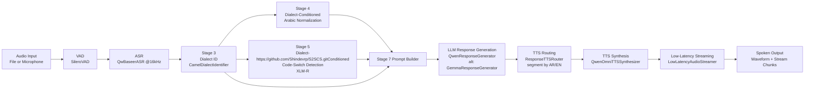

# S2SCS System Architecture

## What We Are Doing

S2SCS is a bilingual Arabic-English speech-to-speech system.
It listens to user audio, detects speech, transcribes it, understands dialect and code-switching behavior, generates a response that preserves speaking style, and synthesizes spoken output with language-aware voice routing.

## End-to-End Architecture



## Core Pipeline Layers

1. Audio Front-End
- Input comes from file mode or live microphone mode.
- VAD filters non-speech chunks to reduce ASR cost and noise.

2. Speech Recognition
- Audio is resampled/prepared for 16 kHz ASR.
- QwBaseer ASR transcribes chunked speech and can return timestamps.

3. Text Intelligence (Dialect + Code-Switch)
- Stage 3 detects Arabic dialect signal (MSA, Gulf, Hejazi) used as conditioning context.
- Stage 4 normalizes mixed Arabic/Arabizi text with dialect-aware normalization.
- Stage 5 runs dialect-aware token classification (AR, EN, NE, OTHER) and computes code-switch metrics:
	- CSI (code-switch index)
	- Matrix/secondary language
	- Embedded language islands

4. Response Generation
- Prompt builder combines normalized text, dialect signal, and code-switch metrics.
- LLM generates a style-preserving bilingual conversational response.

5. Voice Routing and Speech Synthesis
- Router re-analyzes generated tehttps://github.com/Shindevrp/S2SCS.gitxt and splits it into AR/EN segments.
- Each segment is mapped to a voice profile (including Arabic dialect voices).
- Qwen Omni TTS synthesizes segment audio and concatenates final waveform.
- Streamer emits low-latency chunks for real-time playback.

## Main Runtime Paths

1. API server path
- app/api/main.py
- Run with `python -m app.api.main`

2. Live conversational path
- scripts/live_conversation.py
- Captures microphone frames, performs turn detection with VAD, runs full pipeline per utterance, and plays response audio.

## Key Design Principle

Stage 3 dialect output is not just metadata; it explicitly conditions downstream normalization, code-switch detection, and prompting. This keeps response language style aligned with user dialect and bilingual usage patterns.

## Primary Components

- VAD: app/vad/silero_vad.py
- ASR: app/stt/asr_model.py
- Dialect ID: app/dialect/camel_dialect.py
- Normalization: app/normalization/arabic_normalizer.py
- Code-switch detection: app/cs_detection/xlmr_model.py
- Code-switch metrics: app/cs_detection/cs_features.py
- Prompt builder: app/llm/prompt_builder.py
- LLM generation: app/llm/qwen_model.py, app/llm/gemma_model.py
- Pipeline coordination: app/pipeline/main_pipeline.py, app/pipeline/e2e_pipeline.py
- TTS routing: app/tts/tts_router.py
- TTS synthesis: app/tts/tts_model.py
- Streaming: app/streaming/streamer.py
- Configuration: app/config.py, configs/config.yaml
- API Server: app/api/main.py, app/api/routes.py
- Audio I/O: app/audio/capture.py, app/audio/playback.py

## GPU Support

The system automatically detects and uses the best available device:

| Priority | Device | Backend |
|----------|-------|---------|
| 1 | CUDA | NVIDIA GPU (torch.cuda.is_available()) |
| 2 | MPS | Apple Silicon (torch.backends.mps.is_available()) |
| 3 | CPU | Fallback |

Device detection happens automatically in `app/config.py`:

```python
from app.config import DEFAULT_DEVICE, _infer_device
print(f"Using device: {_infer_device()}")  # cuda, mps, or cpu
```

### GPU Configuration

To force CPU mode, set in `configs/config.yaml`:

```yaml
models:
  vad:
    device: cpu  # optional override
```

## Docker Deployment

### Prerequisites

- Docker
- Docker Compose
- NVIDIA GPU (optional, for GPU support)

### Build and Run

#### GPU-enabled (Recommended for production)

```bash
docker-compose up --build s2scs
```

#### CPU-only (Development)

```bash
docker-compose up --build s2scs-cpu
```

### Services

| Service | GPU | Port | Description |
|--------|-----|------|-------------|
| s2scs | Yes | 8000 | Production with NVIDIA GPU |
| s2scs-cpu | No | 8001 | CPU-only for development |

### API Endpoints

```bash
# Health check
curl http://localhost:8000/health/live
curl http://localhost:8000/health/ready

# Metrics
curl http://localhost:8000/metrics

# Transcribe audio
curl -X POST http://localhost:8000/v1/transcribe \
  -F "audio=@recording.wav"

# Text response with audio synthesis
curl -X POST http://localhost:8000/v1/respond \
  -H "Content-Type: application/json" \
  -d '{"text": "اهلا", "synthesize_audio": true}'

# Full streaming pipeline
curl -X POST http://localhost:8000/v1/stream \
  -F "text=اهلا"
```

### WebSocket (Real-time Conversation)

For low-latency real-time conversation, use WebSocket:

```bash
# Interactive chat
python scripts/ws_client.py --url ws://localhost:8000/ws/conversation

# Send text
python scripts/ws_client.py --text "اهلا"

# Send audio
python scripts/ws_client.py --audio recording.wav
```

WebSocket sends events:
- `transcript` - User speech transcribed
- `response_text` - Assistant response
- `audio_chunk` - Audio chunks in real-time
- `complete` - Done

### Environment Variables

| Variable | Default | Description |
|----------|---------|-------------|
| S2SCS_CONFIG_PATH | /app/configs/config.yaml | Config file path |
| TRANSFORMERS_CACHE | /app/models | Model cache directory |
| HF_HOME | /app/models | Hugging Face cache |
| CUDA_VISIBLE_DEVICES | auto | GPU device selection |

### Model Caching and Warmup

The system includes model caching to avoid cold start delays:

| Endpoint | Method | Description |
|---------|--------|-------------|
| GET `/health/warmup` | Check | Returns warmup status and cache stats |
| POST `/health/warmup` | Trigger | Manually trigger model warmup |
| GET `/cache/stats` | Stats | Get cache statistics |
| DELETE `/cache` | Invalidate | Clear cache (for hot-reload) |

Configuration in `configs/config.yaml`:

```yaml
monitoring:
  model_cache_ttl_seconds: 3600    # Cache TTL (1 hour)
  model_warmup_on_startup: true      # Warmup on API start
  lazy_load_models: true            # Lazy loading enabled
```

## Development

### Install Dependencies

```bash
uv pip install -e ".[dev]"
```

### Run API Server

```bash
python -m app.api.main
# or
uvicorn app.api.main:app --host 0.0.0.0 --port 8000
```

### Configuration

Edit `configs/config.yaml` to customize:

| Section | Key | Description |
|---------|-----|-------------|
| server | port | API port (default: 8000) |
| server | warmup_models_on_startup | Load models on startup |
| models.llm | provider | "qwen" or "gemma" |
| models.llm | temperature | LLM creativity (0.0-1.0) |
| audio | input_sample_rate | Input sample rate (16000) |
| audio | max_utterance_s | Max speech turn duration |

Example `configs/config.yaml`:

```yaml
server:
  host: 0.0.0.0
  port: 8000
  warmup_models_on_startup: true

models:
  llm:
    provider: qwen
    model_name_or_path: models/Qwen/Qwen2.5-7B-Instruct
    temperature: 0.7

audio:
  input_sample_rate: 16000
  max_utterance_s: 12.0
```
