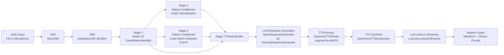

# S2SCS System Architecture

## What We Are Doing

S2SCS is a bilingual Arabic-English speech-to-speech system.
It listens to user audio, detects speech, transcribes it, understands dialect and code-switching behavior, generates a response that preserves speaking style, and synthesizes spoken output with language-aware voice routing.

## Key Design Principle: Dialect-Conditioned Pipeline

**Stage 3 (Dialect ID) output is not just metadata; it explicitly conditions downstream stages.**

The dialect signal flows from Stage 3 to:
- **Stage 4**: Dialect-aware Arabic normalization (different transliteration rules for Gulf vs Hejazi vs MSA)
- **Stage 5**: Dialect-conditioned code-switch detection (dialect embedding injected into XLM-R)
- **Prompt Builder**: Style-preserving bilingual prompting

This ensures response language style aligns with user dialect and bilingual usage patterns.

## End-to-End Architecture



## Step-by-Step Processing Pipeline

### Stage 1: Audio Input & Voice Activity Detection

Input can come from:
- **File mode**: Pre-recorded audio file
- **Live microphone mode**: Real-time audio frames

The VAD (SileroVAD) processes audio in frames (configurable frame duration, default 32ms) and separates:
- Speech segments (high probability)
- Silence segments (below threshold)

VAD reduces ASR cost and noise by filtering non-speech chunks.

**VAD Parameters** (`configs/config.yaml`):
```yaml
audio:
  frame_ms: 32            # Frame duration in milliseconds
  end_silence_ms: 800    # Silence frames to end speech turn
  min_speech_ms: 250    # Minimum speech frames to form turn
  max_utterance_s: 12.0 # Maximum turn duration
  input_sample_rate: 16000
```

**Turn Detection Logic**:
1. Process audio in 32ms frames
2. Frame is speech if probability > threshold (default 0.5)
3. Accumulate speech frames until silence threshold reached
4. Discard turns with < min_speech_ms speech frames

### Stage 2: Speech Recognition (ASR)

- Audio is resampled/prepared for 16 kHz ASR
- QwBaseer ASR transcribes chunked speech
- Returns both text and word-level timestamps
- Multiple speech turns are combined into a single transcript

### Stage 3: Dialect Identification

**Purpose**: Detect which Arabic dialect the user is speaking to condition downstream stages.

**Model**: CAMeL DialectIdentifier (pretrained on Arabic dialect datasets)

**Process**:
1. Extract Arabic text from transcript (filter non-Arabic)
2. If Arabic characters < 6, return MSA fallback
3. Run dialect prediction → returns city-level labels (e.g., "JED", "RIY", "DOH")
4. Map city labels to bucket labels:
   - `JED` (Jeddah) → `Hejazi`
   - `RIY`, `DOH`, `MUS` → `Gulf`
   - All others → `MSA` (Modern Standard Arabic)
5. Aggregate bucket scores from city predictions as confidence scores
6. If confidence < 0.40 and not MSA, fallback to MSA

**Output**: `DialectSignal` containing:
- `conditioning_label`: MSA | Gulf | Hejazi
- `confidence`: float (0.0-1.0)
- `raw_label`: city code
- `bucket_scores`: {dialect: score}
- `is_fallback`: bool
- `fallback_reason`: string (if fallback)

### Stage 4: Dialect-Conditioned Arabic Normalization

**Purpose**: Normalize Arabic code-switched text with dialect-specific rules.

**Process**:
1. Tokenize input text (preserve whitespace and punctuation)
2. For each token:
   - If contains Arabic script:
     - Remove diacritics (tashkeel)
     - Normalize alef variants (أ إ آ ٱ → ا)
     - Normalize hamza (ؤ → و, ئ → ي)
     - Apply dialect-specific word mapping
   - If looks like Arabizi (contains digits 2-9 or '):
     - Convert using digit-to-Arabic mapping (e.g., "7" → "ح", "3" → "ع")
     - Apply dialect-specific lexicon to known words
   - If English: preserve as-is

**Dialect-Specific Lexicons**:
- **Common**: 3ndi→عندي, 7abibi→حبيبي, ma3a→مع, etc.
- **Gulf**: gabel→قبل, shlon→شلون, wish→وش, etc.
- **Hejazi**: da7een→دحين, eish→ايش, lissa→لسه, etc.

### Stage 5: Dialect-Conditioned Code-Switch Detection

**Purpose**: Token-level language classification (AR, EN, OTHER) with dialect conditioning.

**Model Architecture**: Dialect-aware XLM-R Token Classifier

```
XLM-RoBERTa backbone → Dialect Embedding → Linear Classifier
```

- Base model: xlm-roberta-base (768 hidden dims)
- Dialect embedding: 16 dims (learned from MSA/Gulf/Hejazi)
- Combined input: 768 + 16 = 784 dims → num_labels (4)

**Process**:
1. Whitespace tokenize input text
2. Tokenize using XLM-R tokenizer (is_split_into_words=True)
3. Resolve dialect_id from Stage 3 signal (0=MSA, 1=Gulf, 2=Hejazi)
4. Build dialect_ids tensor (broadcast to sequence length)
5. Run inference with inputs: (input_ids, attention_mask, dialect_ids)
6. Aggregate sub-word predictions back to word level:
   - Group sub-word tokens by word_id
   - Mean pool logits → softmax → argmax
7. Return word-level predictions with scores

**Output**: For each word:
- `token`: str
- `label`: AR | EN | NE | OTHER
- `score`: confidence (0.0-1.0)
- `start_char`, `end_char`: character positions

### Stage 6: Code-Switch Metrics Computation

**Purpose**: Compute quantitative metrics from token predictions.

**Metrics Computed**:

1. **CSI (Code-Switch Index)**:
   ```
   CSI = switch_count / valid_transition_count
   ```
   Where switch_count = number of AR→EN or EN→AR transitions

2. **Matrix Language**: Dominant language
   ```
   matrix_language = AR if ar_count >= en_count else EN
   (or by confidence sum if tie)
   ```

3. **Secondary Language**: Non-dominant language (if present)

4. **Embedded Language Islands**: Consecutive tokens of secondary language
   ```
   e.g., "والله والله English word والله" → "English word" is an embedded island
   ```

### Stage 7: Prompt Builder

**Purpose**: Construct LLM prompt with dialect signal and code-switch context.

**Prompt Structure**:
```
[System instructions]
Dialect: {dialect_label} (confidence: {confidence})
Code-Switch: matrix={matrix_language}, csi={csi:.2f}, switches={switch_count}
User utterance: {normalized_text}
[Response generation]
```

This preserves:
- Speaking style (formal MSA vs informal Gulf/Hejazi)
- Bilingual usage patterns (code-switching tendency)
- Response language matching user

### Stage 8: LLM Response Generation

**Models**: Qwen2.5-7B-Instruct or Gemma-2B-It (configurable)

**Process**:
- Load model to device (CUDA/MPS/CPU)
- Generate response with configured temperature and top_p
- Return response text

### Stage 9: TTS Routing & Voice Selection

**Purpose**: Segment response by language and select appropriate voice.

**Routing Process**:
1. Run token detection on generated response (using Stage 5 model)
2. Compute code-switch metrics
3. Build segments by language transition:
   - If consecutive tokens have same label: same segment
   - If label changes: create new segment
4. For each segment:
   - Resolve language: AR | EN
   - Resolve voice:
     - If Arabic: use dialect-aware voice (Gulf voice for Gulf dialect signal)
     - If English: use English voice

**Output**: `RoutedTTSSegment` for each segment containing:
- text: str
- language: AR | EN
- voice: TTSVoiceProfile
- start/end character positions

### Stage 10: TTS Synthesis & Streaming

**Purpose**: Synthesize audio and stream with low latency.

**Synthesis**:
- Use Qwen Omni TTS for bilingual synthesis
- Synthesize each segment in sequence
- Concatenate waveforms with brief pause between segments

**Streaming**:
- Emit first chunk quickly (faster than full synthesis)
- Stream subsequent chunks as they become ready
- Configure chunk duration (default: 320ms first, 160ms subsequent)

## Primary Components

- VAD: app/vad/silero_vad.py
- ASR: app/stt/asr_model.py
- Dialect ID: app/dialect/camel_dialect.py
- Normalization: app/normalization/arabic_normalizer.py
- Code-switch detection: app/cs_detection/xlmr_model.py
- Code-switch metrics: app/cs_detection/cs_features.py
- Prompt builder: app/llm/prompt_builder.py
- LLM generation: app/llm/qwen_model.py, app/llm/gemma_model.py
- Pipeline coordination: app/pipeline/main_pipeline.py, app/pipeline/e2e_pipeline.py
- TTS routing: app/tts/tts_router.py
- TTS synthesis: app/tts/tts_model.py
- Streaming: app/streaming/streamer.py
- Configuration: app/config.py, configs/config.yaml
- API Server: app/api/main.py, app/api/routes.py
- Audio I/O: app/audio/capture.py, app/audio/playback.py

## GPU Support

The system automatically detects and uses the best available device:

| Priority | Device | Backend |
|----------|-------|---------|
| 1 | CUDA | NVIDIA GPU (torch.cuda.is_available()) |
| 2 | MPS | Apple Silicon (torch.backends.mps.is_available()) |
| 3 | CPU | Fallback |

Device detection happens automatically in `app/config.py`:

```python
from app.config import DEFAULT_DEVICE, _infer_device
print(f"Using device: {_infer_device()}")  # cuda, mps, or cpu
```

### GPU Configuration

To force CPU mode, set in `configs/config.yaml`:

```yaml
models:
  vad:
    device: cpu  # optional override
```

## Docker Deployment

### Prerequisites

- Docker
- Docker Compose
- NVIDIA GPU (optional, for GPU support)

### Build and Run

#### GPU-enabled (Recommended for production)

```bash
docker-compose up --build s2scs
```

#### CPU-only (Development)

```bash
docker-compose up --build s2scs-cpu
```

### Services

| Service | GPU | Port | Description |
|--------|-----|------|-------------|
| s2scs | Yes | 8000 | Production with NVIDIA GPU |
| s2scs-cpu | No | 8001 | CPU-only for development |

### API Endpoints

```bash
# Health check
curl http://localhost:8000/health/live
curl http://localhost:8000/health/ready

# Metrics
curl http://localhost:8000/metrics

# Transcribe audio
curl -X POST http://localhost:8000/v1/transcribe \
  -F "audio=@recording.wav"

# Text response with audio synthesis
curl -X POST http://localhost:8000/v1/respond \
  -H "Content-Type: application/json" \
  -d '{"text": "اهلا", "synthesize_audio": true}'

# Full streaming pipeline
curl -X POST http://localhost:8000/v1/stream \
  -F "text=اهلا"
```

### WebSocket (Real-time Conversation)

For low-latency real-time conversation, use WebSocket:

```bash
# Interactive chat
python scripts/ws_client.py --url ws://localhost:8000/ws/conversation

# Send text
python scripts/ws_client.py --text "اهلا"

# Send audio
python scripts/ws_client.py --audio recording.wav
```

WebSocket sends events:
- `transcript` - User speech transcribed
- `response_text` - Assistant response
- `audio_chunk` - Audio chunks in real-time
- `complete` - Done

### Environment Variables

| Variable | Default | Description |
|----------|---------|-------------|
| S2SCS_CONFIG_PATH | /app/configs/config.yaml | Config file path |
| TRANSFORMERS_CACHE | /app/models | Model cache directory |
| HF_HOME | /app/models | Hugging Face cache |
| CUDA_VISIBLE_DEVICES | auto | GPU device selection |

### Model Caching and Warmup

The system includes model caching to avoid cold start delays:

| Endpoint | Method | Description |
|----------|--------|-------------|
| GET `/health/warmup` | Check | Returns warmup status and cache stats |
| POST `/health/warmup` | Trigger | Manually trigger model warmup |
| GET `/cache/stats` | Stats | Get cache statistics |
| DELETE `/cache` | Invalidate | Clear cache (for hot-reload) |

**Cache Architecture** (`app/cache/model_cache.py`):
- Thread-safe cache using `threading.RLock`
- TTL-based expiration (default 3600 seconds)
- Lazy loading on first request
- Per-model key-based storage

```python
class ModelCache:
    def __init__(self, ttl_seconds: int = 3600):
        self._cache: dict[str, CachedModel[Any]] = {}
        self._lock = threading.RLock()
        self._ttl_seconds = ttl_seconds
    
    def get_or_load(self, key: str, factory: Callable[[], T]) -> T:
        # Returns cached value if not expired, otherwise calls factory
```

**Configuration in `configs/config.yaml`**:

```yaml
monitoring:
  model_cache_ttl_seconds: 3600    # Cache TTL (1 hour)
  model_warmup_on_startup: true      # Warmup on API start
  lazy_load_models: true            # Lazy loading enabled
```

## Development

### Install Dependencies

```bash
uv pip install -e ".[dev]"
```

### Run API Server

```bash
python -m app.api.main
# or
uvicorn app.api.main:app --host 0.0.0.0 --port 8000
```

### Configuration

Edit `configs/config.yaml` to customize:

| Section | Key | Description |
|---------|-----|-------------|
| server | port | API port (default: 8000) |
| server | warmup_models_on_startup | Load models on startup |
| models.llm | provider | "qwen" or "gemma" |
| models.llm | temperature | LLM creativity (0.0-1.0) |
| audio | input_sample_rate | Input sample rate (16000) |
| audio | max_utterance_s | Max speech turn duration |

Example `configs/config.yaml`:

```yaml
server:
  host: 0.0.0.0
  port: 8000
  warmup_models_on_startup: true

models:
  llm:
    provider: qwen
    model_name_or_path: models/Qwen/Qwen2.5-7B-Instruct
    temperature: 0.7

audio:
  input_sample_rate: 16000
  max_utterance_s: 12.0
```

## Configuration Reference

Full configuration structure in `configs/config.yaml` and `app/config.py`:

### ServerConfig
| Field | Default | Description |
|-------|---------|-------------|
| host | "0.0.0.0" | Bind address |
| port | 8000 | API port |
| reload | false | Dev mode reload |
| cors_allow_origins | ["*"] | CORS origins |
| rate_limit_per_minute | 60 | Rate limit |
| warmup_models_on_startup | false | Load models on start |

### AudioConfig
| Field | Default | Description |
|-------|---------|-------------|
| input_sample_rate | 16000 | Input sample rate |
| output_sample_rate | 24000 | TTS output rate |
| frame_ms | 32 | VAD frame size |
| end_silence_ms | 700 | Silence to end turn |
| min_speech_ms | 350 | Min speech to form turn |
| max_utterance_s | 12.0 | Max turn duration |
| asr_chunk_ms | 1200 | ASR chunk size |

### ModelConfig
| Model | Config | Description |
|-------|--------|-------------|
| vad | threshold=0.5, device=auto | SileroVAD |
| asr | QwBaseerSTT, 16kHz | Speech recognition |
| dialect | confidence=0.40, min_chars=6 | CAMeL DialectID |
| code_switch | xlm-roberta-base, max_length=256 | XLM-R token classifier |
| llm | Qwen2.5-7B or Gemma-2B | Response generation |
| tts | Qwen2.5-Omni-3B | Speech synthesis |

### PipelineConfig
| Field | Default | Description |
|-------|---------|-------------|
| task_instruction | "Generate a natural conversational response." | LLM prompt |
| language_hint | null | ASR language hint |
| stream_chunk_duration_ms | 120 | Streaming chunk size |
| first_chunk_duration_ms | 40 | First chunk for fast response |

## API Middleware

### Rate Limiting (`app/api/middleware.py`)

- Token bucket algorithm
- Per-IP tracking
- Configurable: `rate_limit_per_minute`

### CORS

- Configurable origins
- Preflight request handling
- Credentials support

## Experimental Methodology

### Test Dataset

The system can be evaluated on bilingual Arabic-English speech datasets:

| Dataset | Description | Use Case |
|---------|------------|----------|
| LLM-adapted Arabic speech | Code-switched AR-EN transcripts | End-to-end evaluation |
| Arabic dialect datasets | MSA, Gulf, Hejazi speech | Dialect ID accuracy |
| Bilingual code-switching corpus | AR-EN alternating speech | Code-switch detection |

### Evaluation Metrics

#### Stage 3: Dialect Identification
- **Accuracy**: Correct bucket label (MSA/Gulf/Hejazi)
- **Confidence**: Average confidence score across test set
- **Fallback rate**: Percentage of utterances requiring MSA fallback

#### Stage 4: Normalization
- **Word error rate (WER)**: Normalized text vs reference
- **Dialect preservation**: Dialect-specific terms retained

#### Stage 5: Code-Switch Detection
- **Token accuracy**: Per-token AR/EN/OTHER classification
- **CSI correlation**: Computed CSI vs human-annotated CSI
- **Island detection**: F1 score for embedded language islands

#### Stage 9: TTS Routing
- **Language segmentation accuracy**: Correct segment boundaries
- **Voice selection accuracy**: Correct voice assignment

#### End-to-End
- **ASR WER**: Transcription accuracy
- **Response appropriateness**: LLM response quality (human evaluation)
- **Speech naturalness**: TTS output quality (MOS)
- **Latency**: Pipeline delay (audio-in to audio-out)

### Experimental Setup

#### Local Evaluation

Run the pipeline on test audio files:

```bash
# Run end-to-end on test file
python -c "
from app.pipeline.e2e_pipeline import EndToEndSpeechPipeline
from app.config import AppConfig

config = AppConfig.from_yaml('configs/config.yaml')
pipeline = EndToEndSpeechPipeline.from_config(config)

import torchaudio
waveform, sr = torchaudio.load('test_audio.wav')
result = pipeline.run_audio_turn(waveform, sr)
print(f'Transcript: {result.transcription.transcript_text}')
print(f'Response: {result.text_response.response_text}')
"
```

#### API Evaluation

Test individual stages via API:

```bash
# Stage 3: Dialect identification
curl -X POST http://localhost:8000/v1/dialect \
  -H "Content-Type: application/json" \
  -d '{"text": "اهلا كيف حالك"}'

# Stage 5: Code-switch detection
curl -X POST http://localhost:8000/v1/code-switch \
  -H "Content-Type: application/json" \
  -d '{"text": "hello كيف حالك", "dialect": "MSA"}'
```

#### Benchmarking

Run latency benchmarks:

```bash
# Full pipeline latency
python scripts/benchmark.py --iterations 100

# Per-stage latency breakdown available in metrics:
# GET http://localhost:8000/metrics
```

### Ablation Study

To evaluate the impact of dialect conditioning:

1. **Without dialect conditioning**: Set `confidence_threshold=1.0` forcing MSA fallback
2. **Compare metrics**: Code-switch detection accuracy, response style alignment

### Reproducibility

```bash
# Set seeds for reproducibility
export TORCH_SEED=42
export CUDA_SEED=42

# Use deterministic algorithms
export CUDNN_DETERMINISTIC=1
```
