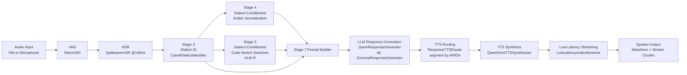

# S2SCS System Architecture

## What We Are Doing

S2SCS is a bilingual Arabic-English speech-to-speech system.
It listens to user audio, detects speech, transcribes it, understands dialect and code-switching behavior, generates a response that preserves speaking style, and synthesizes spoken output with language-aware voice routing.

## End-to-End Architecture

## Core Pipeline Layers

1. Audio Front-End
- Input comes from file mode or live microphone mode.
- VAD filters non-speech chunks to reduce ASR cost and noise.

2. Speech Recognition
- Audio is resampled/prepared for 16 kHz ASR.
- QwBaseer ASR transcribes chunked speech and can return timestamps.

3. Text Intelligence (Dialect + Code-Switch)
- Stage 3 detects Arabic dialect signal (MSA, Gulf, Hejazi) used as conditioning context.
- Stage 4 normalizes mixed Arabic/Arabizi text with dialect-aware normalization.
- Stage 5 runs dialect-aware token classification (AR, EN, NE, OTHER) and computes code-switch metrics:
	- CSI (code-switch index)
	- Matrix/secondary language
	- Embedded language islands

4. Response Generation
- Prompt builder combines normalized text, dialect signal, and code-switch metrics.
- LLM generates a style-preserving bilingual conversational response.

5. Voice Routing and Speech Synthesis
- Router re-analyzes generated text and splits it into AR/EN segments.
- Each segment is mapped to a voice profile (including Arabic dialect voices).
- Qwen Omni TTS synthesizes segment audio and concatenates final waveform.
- Streamer emits low-latency chunks for real-time playback.

## Main Runtime Paths

1. Live conversational path
- scripts/live_voice.py
- Captures microphone frames, performs turn detection with VAD, runs full pipeline per utterance, and plays response audio.

## Key Design Principle

Stage 3 dialect output is not just metadata; it explicitly conditions downstream normalization, code-switch detection, and prompting. This keeps response language style aligned with user dialect and bilingual usage patterns.

## Primary Components

- VAD: app/vad/silero_vad.py
- ASR: app/stt/asr_model.py
- Dialect ID: app/dialect/camel_dialect.py
- Normalization: app/normalization/arabic_normalizer.py
- Code-switch detection: app/cs_detection/xlmr_model.py
- Code-switch metrics: app/cs_detection/cs_features.py
- Prompt builder: app/llm/prompt_builder.py
- LLM generation: app/llm/qwen_model.py, app/llm/gemma_model.py
- Pipeline coordination: app/pipeline/main_pipeline.py, app/pipeline/target_streaming_pipeline.py
- TTS routing: app/tts/tts_router.py
- TTS synthesis: app/tts/tts_model.py
- Streaming: app/streaming/streamer.py
